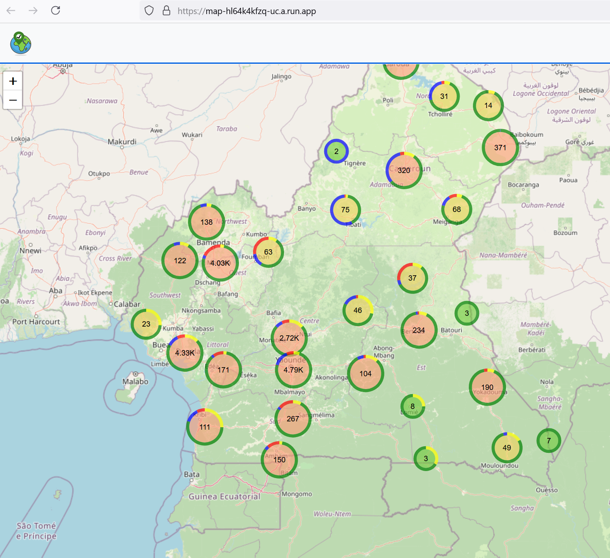

- TODO : create a read-only role in pg db for 
- TODO : finish upload enterprises
- TODO : remove file import, instead create a button with to logic 
      - fetch_coordinates
      - update object
   - on whatever object 
   - app\jobs\import_entreprise_data_job.rb


# Map Cluster

## Présentation
Map permet d'importer tous types de données pour les représenter ensuite sous forme de Donut cluster
Ce projet est pensé pour représenter des entreprises, des boutiques
Une démo en ligne est disponible avec les boutiques du Cameroun :

https://map-hl64k4kfzq-uc.a.run.app/


- Map est une application Ruby on Rails avec PostgreSQL et Bootstrap


# Ce document explique les étapes nécessaires pour installer, configurer et lancer votre application Ruby on Rails.

## Configuration 
### Prérequis 
- **Ruby** : v3.1.2 or above
- **Rails** : v7.1.3
- **PostgreSQL** : any
- **Node.js** : v20.x (installation via NVM recommandée)

### windows
1. **Installer Ruby et Rails** 
- tout en un : https://railsinstaller.dev/
- manuellement : https://www.nethad.io/2021/12/19/rails70-on-windows-without-wsl/

- Check whether winget is installed, if not install or update App Installer from the Microsoft Store from here
- Open PowerShell and enter: winget install OpenJS.NodeJS.LTS; winget install Yarn.Yarn; winget install Git.Git; winget install RubyInstallerTeam.RubyWithDevKit
- Close Powershell, open “Start Command Prompt with Ruby”, enter: ridk install 3.3.3
- Close prompt, open a PowerShell, enter: gem install sqlite3; gem install rails --version "~> 7.1.3" --no-doc; 
bundle install

2. **Installer Node.js**  
```
choco install nodejs-lts --version="20.16.0"
```

3. **Installer PostgreSQL**  

- https://www.postgresql.org/download/windows/

4. **Installer les dépendances de l'application**  
À la racine de votre projet, exécutez les commandes suivantes :  
   ```bash
   bundle install
   yarn install
   ```

5. **Configurer la base de données**  
Créez et migrez la base de données :  
   ```bash
   rails db:create
   rails db:migrate
   ```

7. **Lancer l'application**  
Pour lancer l'application, utilisez la commande foreman suivante  :  
```bash
rails server
```

Ouvrer votre navigateur : 
   - $host:port/login 
   - ex : 
      - [http://localhost:3000](http://localhost:3000)


- Une erreur s'affiche, mais vous y êtes presque !
- Il reste seulement à ajouter un utilisateur 

8. Créer un utilisateur administrateur
 Ouvrez la console Rails :  
   ```bash
   rails c
   ```
9. Créez un utilisateur :  
   ```ruby
   User.create(email: "boutique@boutique.com", password: "boutique@boutique.com", password_confirmation: "boutique@boutique.com")
   ```

10. Connectez-vous avec l'utilisateur créé à l'URL suivante :  
   - $host:port/login 
   - ex : 
      - [http://localhost:3000/login](http://localhost:3000/login)

C'est bon vous y êtes !

## Génération des données 

### Le job d'import

Map permet d'importer tous types de données pour les représenter ensuite sous forme de cluster map.
La table par défaut entreprise 


### Peupler de fausses données avec les seeds
Vous pouvez peupler votre base de données avec des catégories et des entreprises en exécutant les seeds. 
Ajoutez le code suivant à votre fichier `db/seeds.rb` :

```ruby
# Seed categories
categories = []
10.times do |i|
  code = Faker::Number.unique.number(digits: 4).to_s
  description = Faker::Company.industry
  categories << Category.create!(code: code, description: description)
end

# Seed entreprises
1000.times do
  category = categories.sample
  Entreprise.create!(
    niu: Faker::Number.unique.number(digits: 10).to_s,
    forme: Faker::Company.type,
    raison_sociale_rgpd: Faker::Company.name,
    sigle: Faker::Company.suffix,
    activite: Faker::Company.industry,
    region: Faker::Address.state,
    departement: Faker::Address.city,
    ville: Faker::Number.number(digits: 4),
    commune: Faker::Address.community,
    quartier: Faker::Address.street_name,
    lieux_dit: Faker::Address.street_address,
    boite_postale: Faker::Address.postcode,
    npc: Faker::Number.number(digits: 3),
    npc_intitule: Faker::Lorem.word,
    isic_refined: category.code.to_i,
    isic_1_dig: category.code.to_i,
    isic_2_dig: category.code.to_i,
    isic_3_dig: category.code,
    isic_4_dig: category.code,
    isic_intitule: category.description,
    latitude: rand(2.0..13.0),  # Latitudes spécifiques au Cameroun
    longitude: rand(8.0..16.0),  # Longitudes spécifiques au Cameroun
    created_at: Time.now,
    updated_at: Time.now
  )
end

puts "Seed completed successfully!"
```

Pour exécuter les seeds, utilisez la commande suivante :
```bash
rails db:seed
```

## Outils utiles

- **PostgreSQL pour macOS** : [Postgres.app](https://postgresapp.com/)
- **Interface utilisateur pour PostgreSQL** : [pgAdmin](https://www.pgadmin.org/)

## Documentation supplémentaire

Ce README couvre les étapes essentielles pour configurer l'application. N'hésitez pas à le personnaliser en fonction de vos besoins spécifiques. 
Pour plus d'informations sur des aspects spécifiques comme les tests, la configuration avancée, ou le déploiement, vous pouvez inclure des sections supplémentaires comme :

- Version de Ruby utilisée
- Dépendances système
- Configuration spécifique
- Instructions de déploiement

---


NB : pour une meilleure gestion des processus vous pouvez utiliser foreman à la place de `rails server`
- **Installer Foreman**  
Foreman permet de gérer les processus de développement. Installez-le avec les commandes suivantes :  
```bash
npm install -g foreman
yarn global add foreman
```
```bash
nf start -f Procfile.dev --env /dev/null
```

***

icon from : https://commons.m.wikimedia.org/wiki/File:Georeferenced_observation.png